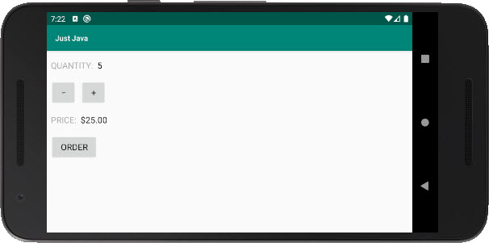
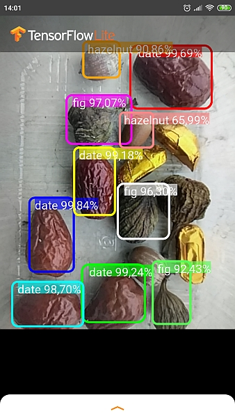

## Set of exercises to understand [Android](https://developer.android.com) development

   - [Courses](#courses)
   - [Additional useful tools](#tools)
   - [How-tos](#how-tos)
   - [Object detection demo](#object_detection_demo)

<!-- for unfinished projects

**Under construction...**
-->

---
### <a name="courses" />Courses

At first it is useful to find appropriate video course.
You can review a list of online courses at
[Class Central. Android Development](https://www.classcentral.com/subject/android-development)

I selected some Google courses. Each course is in a separate catalog and designed as an independent project:
   01. [Android Basics: User Interface](https://www.udacity.com/course/android-basics-user-interface--ud834) 
       The course may seem too simple. However, do not rush to move on to more advanced courses.
       Try to understand the basic concepts and vocabulary slang used in the development of Android (lessons 1, 2).
       Install Android Studio (lesson 3), create your first project for Android Studio IDE and make some basics GUI.
        The source code with examples is in the [01.basics_-_user_interface](01.basics_-_user_interface) directory.
       
       

   02. [Android Basics: User Input](https://www.udacity.com/course/android-basics-user-input--ud836) 
       By the end of this course, you’ll be able to make an Android app with buttons and text fields
       that a user can interact with. This Java app allows user to fill out a form to order coffee.
        The source code with examples is in the [02.basics_-_user_input](02.basics_-_user_input) directory.

       

       
       **Under construction...**

   03. [Android Basics: Multiscreen Apps](https://www.udacity.com/course/android-basics-multiscreen-apps--ud839) 
       Miwok language app. The app is a list of words and each word could have an English and Miwok
       translation. You can take this app and modify it to teach any language.
        The source code with examples is in the [03.basics_-_multiscreeen_apps](03.basics_-_multiscreeen_apps) directory.

       
       **Under construction...**

   04. [Android Basics: Networking](https://www.udacity.com/course/android-basics-networking--ud843) 

   05. [Android Basics: Data Storage](https://www.udacity.com/course/android-basics-data-storage--ud845) 

   06. [Developing Android Apps](https://www.udacity.com/course/new-android-fundamentals--ud851) 

   07. [Advanced Android App Development](https://www.udacity.com/course/advanced-android-app-development--ud855) 
   
   08. [Advanced Android with Kotlin](https://www.udacity.com/course/advanced-android-with-kotlin--ud940)

Videos:
   * [Best Android Studio Developer Course for 2019?](https://youtu.be/YnjNoRDi2bM) - 12 hours course.
   * [Developing Android Apps with Java: Build a Flashlight App](https://youtu.be/dhWL4DC7Krs) - 40 min. guide.

For Java programming language there are two courses on official Android page:
   * Fundamentals. [Codelabs for Android Developer Fundamentals](https://developer.android.com/courses/fundamentals-training)
   * Advanced. [Advanced Android Development](https://developer.android.com/courses/advanced-training)

Additional free online video courses:
   * Coursera. University of Maryland. [Programming Mobile Applications for Android Handheld Systems: Part 1](https://www.coursera.org/learn/android-programming)
   * Coursera. University of Maryland. [Programming Mobile Applications for Android Handheld Systems: Part 2](https://www.coursera.org/learn/android-programming-2)
   * Udemy. [Learn Android Application Development](https://www.udemy.com/course/learn-android-application-development-y)
   * Udemy. [Become an Android Developer from Scratch](https://www.udemy.com/course/become-an-android-developer-from-scratch)
   * Udemy. [The Complete Android Oreo(8.1) , N, M and Java Development](https://www.udemy.com/course/the-complete-android8-oreo-nougat-m-java-development)
   * Udemy. [Android Fundamentals: Ultimate Tutorial for App Development](https://www.udemy.com/course/the-complete-android8-oreo-nougat-m-java-development)

---
### <a name="tools" />Additional useful tools

Additional useful tools everybody Android developer should know about:
   * [Vocabulary Glossary](https://developers.google.com/android/for-all/vocab-words) 
     This glossary of Android and Java vocab words supplements the
     [Udacity Android for Beginners course](https://www.udacity.com/course/android-basics-user-interface--ud834).
     This course is targeted at those who are new to programming but want to start building Android apps.
       
   * Build high-quality digital experiences using [Material Design](https://material.io/design).
     Material is an adaptable system of guidelines, components, and tools that support the best practices
     of user interface design. Backed by open-source code, Material streamlines collaboration between
     designers and developers, and helps teams quickly build beautiful products.
     Also find more at a directory of [essential design tools and resources](https://design.google/resources)
     to keep your projects moving forward.
       
   * [XML Layout Code](https://labs.udacity.com/android-visualizer) is a simple online Android visualizer.
       
   * [Take a screenshot](https://developer.android.com/studio/debug/am-screenshot.html)
     with your cell phone and Android Studio IDE.
       
   * [Google Developers Codelabs](https://codelabs.developers.google.com) provide a guided, tutorial,
     hands-on coding experience. Most codelabs will step you through the process of building
     a small application, or adding a new feature to an existing application.
       
   * [Common Android View Cheat Sheet PDF](https://drive.google.com/file/d/0B5XIkMkayHgRMVljUVIyZzNmQUU)
     will help you to start editing Common Android Views.
       

---
### <a name="how-tos" />How-tos

[How-tos](how-tos.md) about Android and other tools.

---
### <a name="object_detection_demo" />[Object detection demo](object_detection_demo)

There are 2 main components:
   01. [model training scripts](object_detection_demo/01_training_script) -
       Google Colab `*.ipynb` scripts to use
       [TensorFlow object detection API](https://github.com/tensorflow/models/tree/master/research/object_detection).
   02. [mobile app](02_mobile_app) -
       a mobile application that uses trained model in Android. It was copied from
       [TensorFlow Lite object detection Android Demo](https://github.com/tensorflow/examples/tree/master/lite/examples/object_detection/android).
