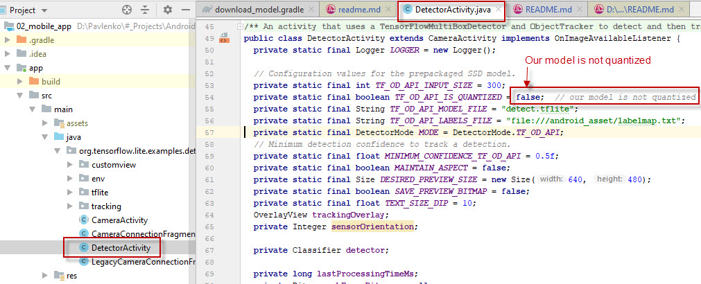

# TensorFlow Lite Object Detection Android Demo

## Overview
This is a camera app that continuously detects the objects (bounding boxes and classes)
in the frames seen by your device's back camera, using a quantized
[MobileNet SSD](https://github.com/tensorflow/models/tree/master/research/object_detection)
model trained on the [COCO dataset](http://cocodataset.org/).
These instructions walk you through building and running the demo on an Android device.

The model files are downloaded via Gradle scripts when you build and run.
You don't need to do any steps to download TFLite models into the project explicitly.

Application can run either on device or emulator.

## Build the demo using Android Studio

### Prerequisites

   * If you don't have already, install [Android Studio](https://developer.android.com/studio/index.html),
     following the instructions on the website.
   * You need an Android device and Android development environment with minimum API 21.
   * Android Studio 3.2 or later.

### Building
   * Open Android Studio, and from the Welcome screen, select
     `Open an existing Android Studio project`.
   * From the `Open File` or `Project window` that appears, navigate to and select the
     `/object_detection_demo/02_mobile_app/android` directory. Click OK.
   * If it asks you to do a Gradle Sync, click OK.
   * You may also need to install various platforms and tools, if you get errors like
     `Failed to find target with hash string 'android-21'` and similar.

Click the Run button (the green arrow) or select `Run > Run 'android'` from the top menu.
You may need to rebuild the project using `Build > Rebuild Project`.

   * If it asks you to use Instant Run, click Proceed Without Instant Run.
   * Also, you need to have an Android device plugged in with developer
     options enabled at this point. See [here](https://developer.android.com/studio/run/device)
     for more details on setting up developer devices.

### Model used
Downloading, extraction and placing it in assets folder has been managed automatically
by download.gradle.

If you explicitly want to download the model, you can download it from
[here](https://drive.google.com/uc?export=download&id=1KQwgC5k0I9qggCFbBRDhl8MrQ0hWwthj).
Extract the zip to get the `.tflite` and `label` file.

### Additional Note
_Please do not delete the assets folder content_.
If you explicitly deleted the files, then please choose
`Build -> Rebuild` from menu to re-download the deleted model files into assets folder.

## Use your own model
To use your own model:
   * Take existing pre-trained model from the
     [model zoo](https://github.com/tensorflow/models/blob/master/research/object_detection/g3doc/detection_model_zoo.md),
     test it with [`demo_1.ipynb`](https://colab.research.google.com/drive/1OkqFXb1GSxi7oNkiGfGttSmhaob4ivFy) script
     or train your own model on a new dataset
     ([`demo_2.ipynb`](https://colab.research.google.com/drive/1sKb5rXrwiJTxzk0jZxAmpfIYUg0gj4Bw)).
   * Create `*.tar.gz` or `*.zip` file from `detect.tflite` with your model and
     `labelmap.txt` with your labels. Save `*.tar.gz` or `*.zip`  to the Google Drive.
     **Note**: `labelmap.txt` file should start with `???` string, because zero position is reserved.
     So your class labels will start from the 1st position after `???` string.
   * Get downloadable direct link using direct link generator for
     [Google Drive](https://www.wonderplugin.com/online-tools/google-drive-direct-link-generator),
     [Dropbox or Onedrive](https://syncwithtech.blogspot.com/p/direct-download-link-generator.html).
   * Replace link in the mobile app [`download_model.gradle`](app/download_model.gradle)
     file on your link. Use `zipTree` for `*.zip` and `tarTree` for `*.tar.gz`.
     
   * Our model is not quantized, so set quantized to `false` in
     [`DetectorActivity.java`](app/src/main/java/org/tensorflow/lite/examples/detection/DetectorActivity.java)
     file
     
   * Delete `build` folder and clean `assets` folder.
     Rebuild the project: `Build --> Make Project` then `Build --> Build Bundles --> Build APK`.
   * Run mobile app (`Run --> Run 'app'`) in Android Studio and enjoy!
